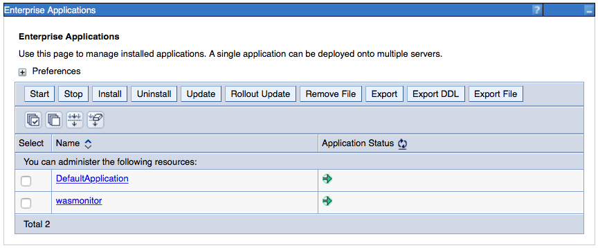
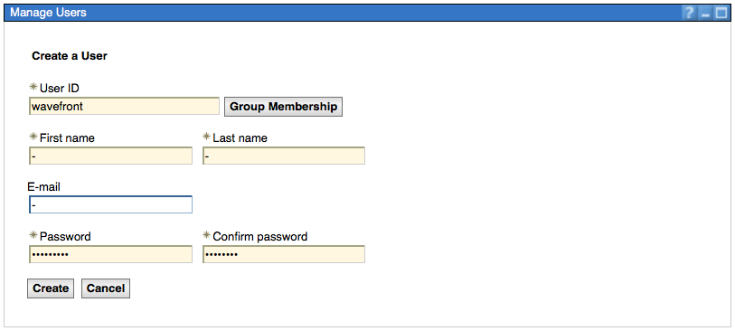
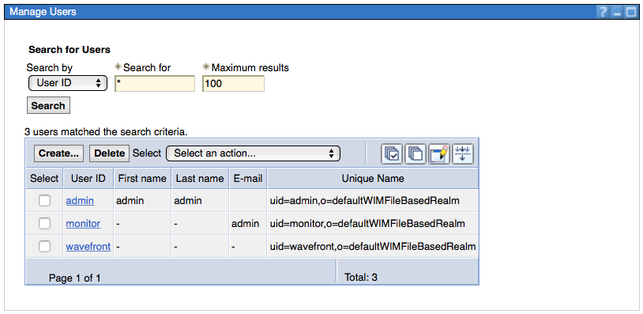
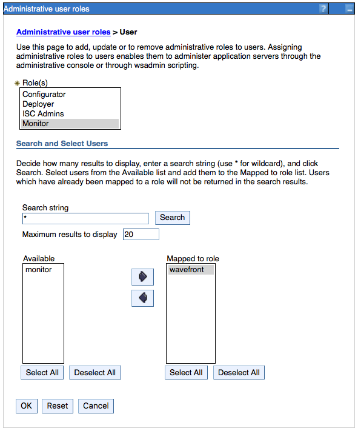
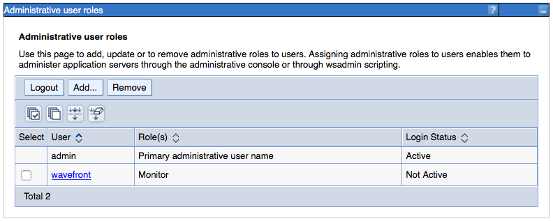
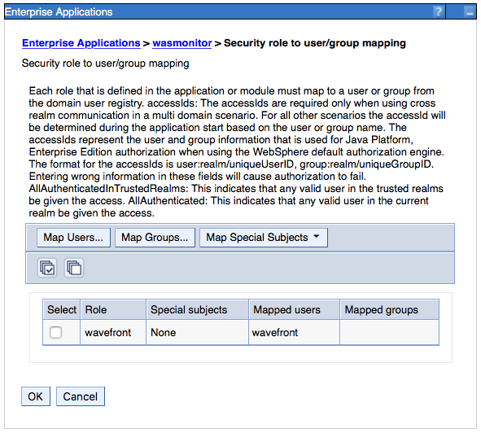

# wasmonitor

This web application will get the most important WebSphere JMX metrics and publish it on JSON format.

## How-To build
1. Get theses files from your WebSphere instalation:
  * com.ibm.ws.admin.client_8.5.0.jar
  * JSON4J.jar
2. Copy those files to the `lib` directory.
3. Run `mvn clean isntall`
4. the `wasmonitor.war` will be on the `target` direcotry.

## How-to deploy

1. Deploy the war on your WebSphere:
   
2. Crete a 'wavefront' user on WebSphere:
   
   
3. Assign the 'monitor' role to the 'wavefront' user:
   
   
4. Map application role 'wavefront' to the user 'wavefront':
   
5. Verify the `wasmonitor.war` installation by accessing this URL: `http://<was_address>:<was_port>/wasmonitor/info`.

The result looks similar to this:
```
{"websphere.version": "8.5.5.12", "wasmonitor.version": "1.0"}
```


## Endpoints

* `/wasmonitor/stats` list of metrics and its values on JSON format.
* `/wasmonitor/list` list of all mBean with its attibutes and operations decriptions.
* `/wasmonitor/info` wasmonitor and WebSphere versions.
